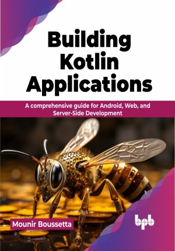

# Building Kotlin Applications

Unlock your programming potential with Kotlin - Start building today

This is the repository for [Building Kotlin Applications
](https://bpbonline.com/products/building-kotlin-applications?variant=42982065209544),published by BPB Publications.

## About the Book
Kotlin is a modern, expressive, and concise programming language popular among developers for its many benefits. These include its interoperability with Java, ability to build native mobile and web applications, and support for functional programming.

This book provides a comprehensive introduction to Kotlin, covering everything you need to know to start building Kotlin applications, regardless of your prior programming experience.

You'll start by learning the basics of Kotlin, including its variables, types, functions, and control flow statements. Then, you'll explore more advanced topics such as object-oriented programming, generics, coroutines, RxKotlin, and multiplatform development. Once you have a solid foundation in Kotlin, you'll learn how to use it to build real-world applications. You'll start with a simple Android application and then move on to more complex projects, such as a web application and a desktop application.

By the end of this book, you will have a deep understanding of Kotlin and be confident in your ability to use it to build robust, maintainable, and scalable applications.

## What You Will Learn
• Learn Kotlin syntax, type system, and basic concepts to write idiomatic, expressive, and safe code.

•  Build robust and scalable applications using Kotlin, including web, mobile, and desktop applications. Use reactive patterns and frameworks such as Spring Boot to design highly scalable and resilient applications.

•  Apply best practices and design patterns to write maintainable and reusable code.

•  Write code that is reliable and easy to maintain.

•  Become a more productive and efficient programmer.
